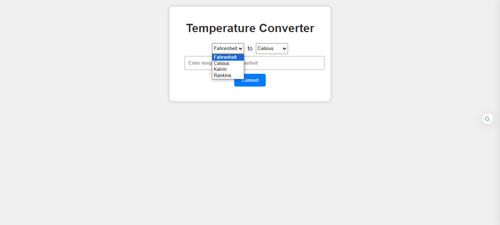

# ⭐ Welcome to Hacktoberfest 2023 ⭐

Beginners can contribute for [Hacktoberfest](https://hacktoberfest.com)</br>
</br><div style="text-align: center;">

</div>
</br>

## What is Hacktoberfest?

Hacktoberfest encourages participation in giving back to the open-source community by completing pull requests, participating in events, and donating to open source projects.

## How does Hacktoberfest works?

- You can register yourself anytime between September 26 to October 31 on  [Hacktoberfest](https://hacktoberfest.com).
- To qualify for digital swags, you need to register and make 4 accepted pull requests between October 1-31.
- A pull request before and after October 1-31 will not be considered.
- You can Contribute to the repository marked with Hacktoberfest label.
- You must NOT spam or else you will be disqualified from the fest.
- Follow the Project's code of conduct.
 </br>
  
# temp-conversion

A very simple celsius to farenheit convertor.</br>
</br>

## What you can do?

- Make it more clean, modular and beautiful.
- Make it more responsive.
- Add other temperature conversion, etc.
- No Code Contribution-- Documentation, design and more!

# First Contribution Guide

Don't Worry if this is you First Contribution. Follow this guide.

## Step 1: Fork the repository

Click the "Fork" button at the top of this page. This action will create a copy of this repository in your GitHub account.

## Step 2: Clone the repository

Go to your GitHub account, open the forked repository, click on the "Code" button, and then click the "Copy to clipboard" icon.

Open your terminal and run the following command, replace  `"url copied"` with the copied URL:

```shell
git clone "url copied"
```

This will clone the forked repository to your local machine.

## Step 3: Change the directory

If not already there, run

```shell
cd temp-conversion
```

## Step 4: Create a branch

Use  `git checkout` command to create your own branch.

```shell
git checkout -b NameOfYourBranch
```

## Step 5: Make necessary changes

Change the files or add as per the requirement/assignment.

## Step 6:  Check and Commit the changes

If you run the `git status` command in your project directory, you'll see there are changes. Add those changes to the branch you created using the `git add` command:

Example: If you changed exampleFile

```shell
git add exampleFile
```

Now commit the changes:

```shell
git commit -m "Updated exampleFile"
```

Replace Updated exampleFile with your short comment.

## Step 7: Push your changes to GitHub

Use the `git push` command to push your changes to GitHub:

```shell
git push origin -u NameOfYourBranch
```

## Step 8: Submit your changes for review

Go to your repository on GitHub, and you'll see a "Compare & pull request" button. Click on that button.

Submit the pull request. By clicking on "Create pull request"

## Step 9: Merged?

You will receive a notification email once your changes have been merged.

# How to create an issue?

- Step 1: Open repository
- Step 2: Go to Issues
- Step 3: Go to new Issues
- Step 4: Write and Submit New Issue
- Step 5: Ask the maintainers to assign you the issue
- *You can also take on others' raised issues.*

</br>
<h2 align="center">
    <p>
      ⭐  Happy Hacking!  ⭐
    </p>
</h2>

***


<h2 align="center">
    <p>
        Thank You ⭐
    </p>
</h2>

